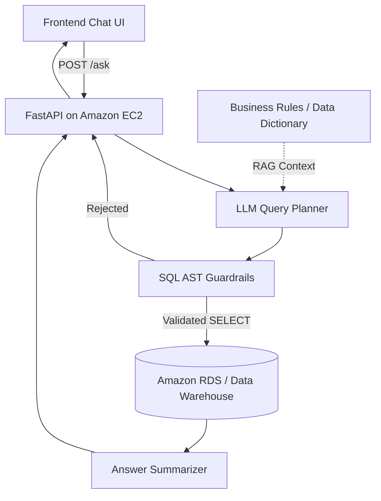

# Agriculture Data Warehouse LLM Agent

ระบบ AI Assistant สำหรับสอบถามข้อมูล Data Warehouse ของสหกรณ์การเกษตรด้วยภาษาธรรมชาติ
รองรับงาน Text-to-SQL, การสรุปผลเป็นภาษาไทย และการเชื่อมต่อ Amazon RDS โดยออกแบบให้
LLM ไม่สามารถ execute SQL ได้โดยตรง

> Project status: MVP skeleton สำหรับส่งต่อทีม AI Engineer และ Web Development

## ภาพรวมระบบ

ผู้ใช้สามารถถามคำถาม เช่น:

- ยอดขายสุทธิรายเดือนเป็นเท่าไร
- ปริมาณผลผลิตที่รับซื้อในแต่ละเดือน
- สินค้าคงคลังปัจจุบันเหลือเท่าไร
- ค่าใช้จ่ายในการจัดส่งแยกตามภูมิภาค

ระบบจะแปลงคำถามเป็น Query Plan ตรวจสอบ SQL ด้วย deterministic guardrails แล้วจึงอ่านข้อมูล
จาก Data Warehouse และสรุปผลกลับเป็นภาษาที่เข้าใจง่าย



## ความสามารถปัจจุบัน

- FastAPI endpoint สำหรับรับคำถามจาก Frontend
- หน้าแชตต้นแบบสำหรับพิมพ์คำถามและแสดงผลลัพธ์
- Framework-neutral LLM boundary ยังไม่ล็อก LangChain หรือ agent framework อื่น
- Schema catalog สำหรับตาราง Fact และ Dimension
- SQL parsing ด้วย SQLGlot ก่อน execute
- อนุญาตเฉพาะ read-only query
- จำกัด schema, table และ column ด้วย allowlist
- ปฏิเสธหลาย SQL statements และ `SELECT *`
- บังคับจำนวนแถวสูงสุดและ PostgreSQL statement timeout
- แสดง SQL, sources, status และ guardrail violations กลับไปยัง Frontend
- รองรับการเพิ่ม RAG และ LLM provider ภายหลัง

## โครงสร้างโปรเจกต์

```text
Cloud_LLMs/
|-- app/
|   |-- agents/          Query plan, agent state และ LLM boundary
|   |-- api/             FastAPI routes และ request/response models
|   |-- core/            Environment settings
|   |-- db/              RDS connection และ warehouse schema catalog
|   |-- guardrails/      Deterministic SQL validation
|   |-- prompts/         System และ Text-to-SQL prompts
|   |-- services/        Application workflow
|   `-- tools/           SQL และ RAG tools
|-- frontend/
|   |-- index.html       หน้าแชตต้นแบบ
|   |-- styles.css       Responsive UI styles
|   |-- app.js           เรียก Backend API และ render ผลลัพธ์
|   |-- docs/            API contract สำหรับทีม Web Development
|   `-- src/             TypeScript API client และ shared types
|-- tests/               SQL guardrail tests
|-- docs/                Architecture, deployment และ framework evaluation
|-- scripts/             Local helper scripts
|-- .env.example         ตัวอย่าง environment variables
|-- requirements.txt     Python runtime dependencies
`-- requirements-dev.txt Development และ test dependencies
```

## เทคโนโลยี

- Backend: Python, FastAPI, Pydantic, SQLAlchemy
- Database: Amazon RDS PostgreSQL
- SQL validation: SQLGlot
- Frontend prototype: HTML, CSS, JavaScript
- Deployment target: Amazon EC2
- LLM provider: ยังไม่เลือก รองรับการต่อ OpenAI, Gemini, Claude หรือโมเดล open-source

## เริ่มต้นใช้งาน

### 1. เตรียม Environment

ต้องมี Python 3.10 ขึ้นไป จากนั้นเปิด PowerShell ที่โฟลเดอร์โปรเจกต์:

```powershell
cd Cloud_LLMs
python -m venv .venv
.\.venv\Scripts\Activate.ps1
python -m pip install -r requirements.txt
Copy-Item .env.example .env
```

แก้ไข `.env` ให้ตรงกับ environment ที่ใช้งาน โดยเฉพาะ `DATABASE_URL` และ API key
ของ LLM provider เมื่อเริ่มเชื่อมต่อ provider จริง

### 2. รัน Backend

```powershell
uvicorn app.main:app --reload --port 8000
```

ตรวจสอบได้ที่:

- Health check: http://localhost:8000/health
- Swagger UI: http://localhost:8000/docs
- OpenAPI JSON: http://localhost:8000/openapi.json

### 3. รัน Frontend

เปิด PowerShell อีกหน้าต่างหนึ่งจาก root ของโปรเจกต์:

```powershell
python -m http.server 5173 --directory frontend
```

เปิดหน้าเว็บที่ http://localhost:5173

Frontend จะเรียก Backend ที่ `http://localhost:8000` โดยค่าเริ่มต้น สามารถเปลี่ยน URL ได้จาก
meta `api-base-url` ใน `frontend/index.html`

## Environment Variables

| Variable | ตัวอย่าง | รายละเอียด |
|---|---|---|
| `APP_ENV` | `local` | ชื่อ environment |
| `CORS_ORIGINS` | `http://localhost:3000,http://localhost:5173` | Frontend origins ที่เรียก API ได้ |
| `LLM_PROVIDER` | `openai` | Provider ที่ต้องการใช้ในอนาคต |
| `LLM_MODEL` | `gpt-4o-mini` | ชื่อโมเดล |
| `OPENAI_API_KEY` | ว่าง | OpenAI credential |
| `GOOGLE_API_KEY` | ว่าง | Gemini credential |
| `ANTHROPIC_API_KEY` | ว่าง | Claude credential |
| `DATABASE_URL` | `postgresql+psycopg://...` | Amazon RDS connection string |
| `DATABASE_SCHEMA` | `data_warehouse` | Schema ที่อนุญาตให้ query |
| `MAX_SQL_ROWS` | `100` | จำนวนแถวสูงสุดต่อ query |
| `MAX_SQL_SECONDS` | `15` | Query timeout เป็นวินาที |

ห้ามนำ API key หรือ database credentials ไปใส่ในไฟล์ Frontend หรือ public environment variables

## API

### `GET /health`

```json
{
  "status": "ok",
  "env": "local"
}
```

### `POST /ask`

Request:

```json
{
  "question": "ยอดขายสุทธิรายเดือนเป็นเท่าไร",
  "user_role": "analyst"
}
```

Response:

```json
{
  "answer": "SQL ผ่าน guardrail แล้ว แต่ยังไม่ได้ตั้งค่า DATABASE_URL",
  "sql": "SELECT ... LIMIT 100",
  "sources": ["schema-catalog"],
  "status": "not_configured",
  "guardrail_violations": []
}
```

สถานะที่ Frontend ต้องรองรับ:

| Status | ความหมาย |
|---|---|
| `answered` | ระบบประมวลผลและตอบคำถามสำเร็จ |
| `rejected` | Query ไม่ผ่าน guardrail และไม่ได้เรียกฐานข้อมูล |
| `not_configured` | ยังไม่ได้ตั้งค่า LLM provider หรือฐานข้อมูล |

ดูรายละเอียดเพิ่มเติมได้ที่ `frontend/docs/API_CONTRACT.md`

## SQL Safety

```text
Question
  -> QueryPlan
  -> Parse SQL AST
  -> Validate schema/table/column allowlist
  -> Enforce SELECT + LIMIT + timeout
  -> Execute with restricted RDS user
  -> Summarize result
```

Guardrail ใน application เป็นเพียงหนึ่งชั้นของการป้องกัน Production RDS ต้องใช้ user ที่มีสิทธิ์
อ่านอย่างเดียว กำหนด network access ผ่าน Security Group และไม่เปิดฐานข้อมูลสู่ public internet

## การทดสอบ

ติดตั้ง development dependencies และรัน test suite:

```powershell
python -m pip install -r requirements-dev.txt
pytest -q
```

Test cases ปัจจุบันครอบคลุม:

- SELECT จาก schema และ table ที่อนุญาต
- write statement
- table และ column นอก allowlist
- `SELECT *` และ `COUNT(*)`
- หลาย statements ใน request เดียว
- การบังคับ `LIMIT`

## สิ่งที่ต้องพัฒนาต่อ

- เลือก LLM framework จาก comparison spike ใน `docs/framework_evaluation.md`
- เชื่อมต่อ LLM provider จริงและบังคับ structured `QueryPlan`
- ยืนยัน schema catalog กับโครงสร้าง Amazon RDS จริง
- เพิ่ม RAG ingestion สำหรับ data dictionary และ business rules
- เพิ่ม authentication, role-based access และ audit logging
- สร้าง Text-to-SQL evaluation set อย่างน้อย 30-50 คำถาม
- เพิ่ม integration tests กับ staging database
- ให้ทีม Web Development ย้ายหน้า prototype เข้า framework หลักของระบบ

## เอกสารเพิ่มเติม

- `docs/data_warehouse_context.md` บริบทและ schema ของ Data Warehouse
- `docs/framework_evaluation.md` การเปรียบเทียบ LLM/agent frameworks
- `docs/llm_scope.md` ขอบเขตงาน AI Engineer
- `docs/aws_ec2_deploy.md` แนวทาง deploy บน Amazon EC2
- `frontend/docs/API_CONTRACT.md` ข้อตกลงระหว่าง Backend และ Frontend
